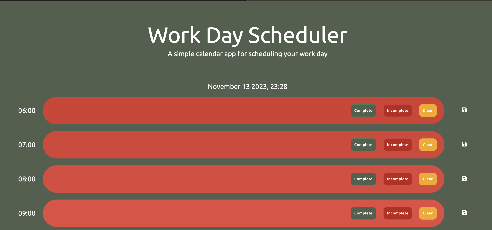
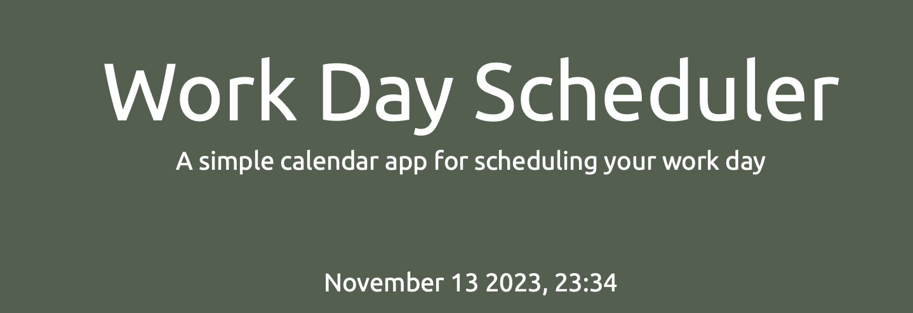
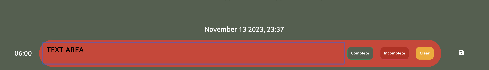
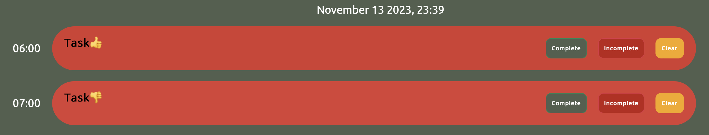

# planner-browser-application
A planner which runs in browser.!

## How to run
This project is deployed via github pages. You can access it [https://ag466.github.io/browser-planner-app/].

The application runs in the browser and features dynamically updated HTML and CSS powered by jQuery. At this stage the application can take user input and save it to local storage. The application also displays the current date and time and color codes the time blocks in relation to the the current time with different colors for past, present and future.

Fields in the past are denoted by a red background, fields in the present are denoted by a off-white background and fields in the future are denoted by a black background.

All fields in version can be edited.

The application also features a clear button which clears the local storage and a complete button which marks the event as complete and an incomplete button which marks the event as incomplete.

## How to use
1. Open the application in the browser.
2. Click on a time block to enter an event.
3. Click the save button to save the event to local storage.
4. Refresh the page to see the event persist.
5. Cick the clear button to clear the event from local storage.
6. Click complete to mark the event as complete.
7. Click incomplete to mark the event as incomplete.

## Time blocks
The term "time-blocks" refer to the individual rows in the application. Each time block represents an hour of the day. The time blocks are color coded to represent past, present and future. The time blocks are also color coded to represent complete and incomplete events.

The time blocks are created through a for loop which iterates through the objects comprising the "times" array [ln 4-113]. For each object of the array, the time property of the object is read and displayed to a time block for the hours 06:00 through 23:00. The time blocks are created dynamically through JavaScript.

 I decided to extend the scope of the hours displayed beyond 9-5 to enable the population of pre-work and post-work tasks. Given the generative capabilities of Javascript the application is easily modified in terms of the window of hours the app can display so it is very easy to shorten/extend the window of time covered. 

## Clock
At the top of the page the current date and time is displayed. The current date and time is updated every second. The current date and time is displayed through the use of day.js. The time is in an extended format including the current second. This was chosen to allow for the user to see the time change in real time but could be amended to a less granular format if desired.

In the current state their is a need to refresh the browser upon hour change to see the changes to the coding of the time blocks. A solution to this issue is yet to be found.

## Text areas:
To alow users to input tasks for each hour window- a text area has been instantiated within each time-block. The text areas will display any cached date from local storage should it exist. 

## Saving data:
One way to save data written to the text areas is to click the floppy-disk icon in the far left of each respective row. A click on this icon triggers a listener which employs a function saving the text area content to local storage. Data will then persist upon refresh and if the content of the text area is deleted without saving the changes, then the text will reapear on refresh.

## Coloring:
To emphasise the distance of a past and proximity of some future event, graduates tones have been set as times grow more distant from the current time. Times in the near past are a light red - graduating to a dark red, whilst times in the near future are a black graduating to a grey as distance from the present increases. 

## Completion status.
I wanted to ensure that not only text, but completion status persists upon refresh. This has been achieve by using an array of objects which have as an attribute a complete property which can be toggled true or false. 

If an entry in the application is marked as complete, a thumbs up is appended to the end of the entry. In the instance where an entry has previously been marked incomplete, the thumbs-up will replace the thumbs-down which would have previously been appended to the text. The inverse of this is true also.

To enable users to remove a task completely I have included a clear button. This ensures that users can remove a task they may have erroneously entered without having to resort to simply marking the task as incomplete.

## Next Steps:
To improve this project I would like to:
1. Add sound reminders to prompt a user when a time block with a task approaches.
2. Enable a user to print to PDF the content of their planner so that they have a record of all of the tasks completed on a given day.
3. Enable users to move between days and see tasks stored for the past and entered for the future.
4. Enable further time-granulation down to the half-hour and then possibly to the 1/4 hour based on user selection.

